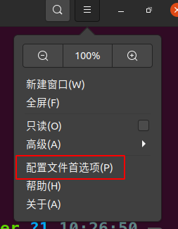
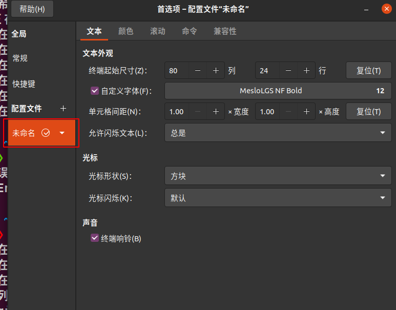
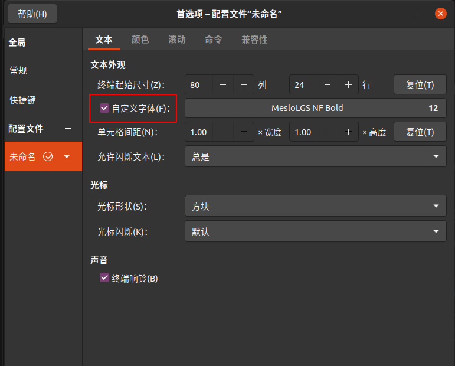
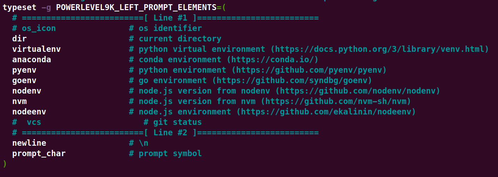
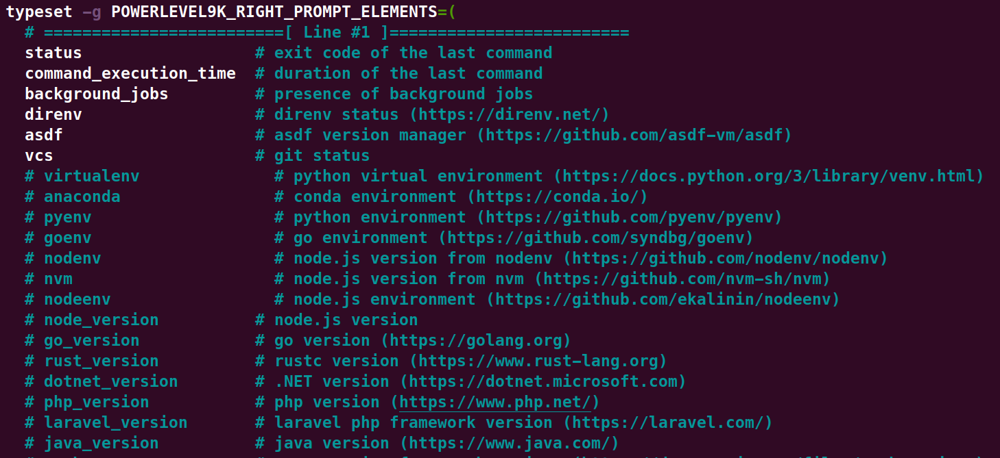
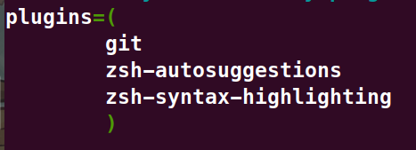

Ubuntu配置zsh美化命令行步骤

# 1. 下载zsh
sudo apt update
sudo apt install -y zsh git curl

# 2. 将命令行窗口切换为zsh终端
chsh -s $(which zsh)

# 3. 安装Oh My Zsh终端配置
sh -c "$(curl -fsSL https://raw.github.com/ohmyzsh/ohmyzsh/master/tools/install.sh)"

# 4. 安装P10k终端主题，克隆到~/.oh-my-zsh/custom/themes下
git clone --depth=1 https://github.com/romkatv/powerlevel10k.git ${ZSH_CUSTOM:-$HOME/.oh-my-zsh/custom}/themes/powerlevel10k

# 5. 切换为P10k主题，改zshrc文件中ZSH_THEME内容
nano ~/.zshrc
ZSH_THEME="powerlevel10k/powerlevel10k" # 或使用指令直接修改 sed -i 's|^ZSH_THEME=.*|ZSH_THEME="powerlevel10k/powerlevel10k"|' ~/.zshrc

# 6. 安装字体，避免乱码
如果上述步骤后自动打开了P10k设置页面，不乱码的情况下可以先完成设置
如果设置界面乱码，建议 cutl+c 退出设置，先完成字体安装

mkdir ~/.local/share/fonts
cd ~/.local/share/fonts
可以下载仓库中的fonts文件夹安装字体，也可以使用下列网络下载

wget -O "MesloLGS NF Regular.ttf" "https://github.com/romkatv/powerlevel10k-media/raw/master/MesloLGS%20NF%20Regular.ttf"

wget -O "MesloLGS NF Bold.ttf" "https://github.com/romkatv/powerlevel10k-media/raw/master/MesloLGS%20NF%20Bold.ttf"

wget -O "MesloLGS NF Italic.ttf" "https://github.com/romkatv/powerlevel10k-media/raw/master/MesloLGS%20NF%20Italic.ttf"

wget -O "MesloLGS NF Bold Italic.ttf" "https://github.com/romkatv/powerlevel10k-media/raw/master/MesloLGS%20NF%20Bold%20Italic.ttf"

fc-cache -fv # 刷新字体

打开终端，点击右上角的菜单 -> preferences/配置文件首选项 -> profile/配置文件 -> 勾选Custom font/自定义字体 -> 选择刚刚安装的字体（后续可以自己找字体，仓库提供的字体只是保证不乱码）

如果这一步之前退出了P10k设置，命令行输入下属指令重新进行设置，按照提示和自己的喜好进行设置即可
p10k configure

# 6. 设置p10k左右侧标签内容
p10k设置只支持修改美化效果，不能修改左右标签显示的内容和顺序，这部分可以通过修改p10k配置文件进行修改

nano ~/.p10k.zsh

找到typeset -g POWERLEVEL9K_LEFT_PROMPT_ELEMENTS和typeset -g POWERLEVEL9K_RIGHT_PROMPT_ELEMENTS，修改内容和顺序

保存回到命令行窗口

source ~/.zshrc

# 7. 安装命令补全建议和语法高亮插件（不是美化插件，便捷化插件，建议安装）
git clone https://github.com/zsh-users/zsh-autosuggestions ${ZSH_CUSTOM:-~/.oh-my-zsh/custom}/plugins/zsh-autosuggestions

git clone https://github.com/zsh-users/zsh-syntax-highlighting ${ZSH_CUSTOM:-~/.oh-my-custom}/plugins/zsh-syntax-highlighting

nano ~/.zshrc

找到plugins，将安装的插件名写入

保存后回到命令行窗口

source ~/.zshrc

# 8. 环境配置
设置zsh后会导致命令行窗口的初始化指令会从zshrc文件中读，而不是原来的bashrc，所以如果设置了初始某些变量或者conda环境配置等内容，需要将相应的初始化配置内容从bashrc文件中复制到zshrc后保存即可

